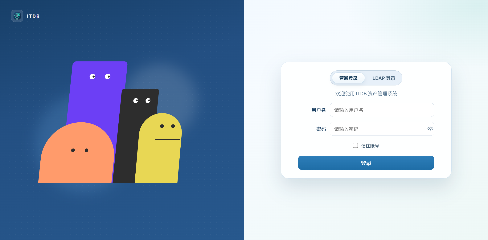
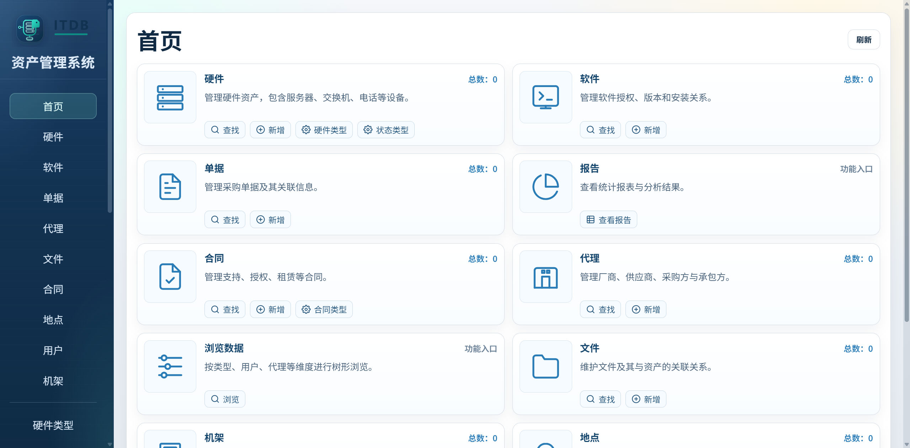

# ITDB — IT Asset Management System

Reconstructed from [sivann/itdb](https://github.com/sivann/itdb) (PHP + SQLite), this is an IT asset management system reimplemented with a Go + Vue3 frontend-backend separation architecture. It supports full lifecycle management of hardware devices, software licenses, contracts, documents, files, racks, and locations.

The animation effect on the left side of the login page is inspired by [Animated Characters Login Page](https://21st.dev/community/components/aghasisahakyan1/animated-characters-login-page).

## Table of Contents

- [Documentation Site](#documentation-site)
- [I. Project Introduction](#i-project-introduction)
- [II. Local Development Quick Start](#ii-local-development-quick-start)
- [III. Docker Compose Quick Deployment (Recommended)](#iii-docker-compose-quick-deployment-recommended)
- [IV. Production Environment Deployment](#iv-production-environment-deployment)
- [V. API Documentation](#v-api-documentation)
- [VI. Database Description](#vi-database-description)
- [VII. FAQ](#vii-faq)
- [VIII. Security Recommendations](#viii-security-recommendations)
- [IX. License](#ix-license)
- [X. Version History](#x-version-history)
- [XI. Acknowledgments](#xi-acknowledgments)
- [XII. Contact Information](#xii-contact-information)

# Documentation Site

> **Online Documentation Site: https://itdb-docs.jerion.cn/**

# I. Project Introduction

## 1.1 Project Overview

Reconstructed from [sivann/itdb](https://github.com/sivann/itdb) (PHP + SQLite), this IT asset management system is reimplemented with a Go + Vue3 frontend-backend separation architecture. It supports full lifecycle management of hardware devices, software licenses, contracts, documents, files, racks, and locations.

## 1.2 Project Preview

|               Project Login Page                |
| :-------------------------------------: |
|  |

|               Project Home Page                |
| :-----------------------------------: |
|  |

## 1.3 Project Features

- **Frontend-Backend Separation**: `Go + SQLite` backend, `Vue3 + Vite + TypeScript` frontend
- **Pure Go Implementation**: SQLite driver using `modernc.org/sqlite`, no CGO dependencies, cross-compilation friendly
- **Dual Authentication Modes**: Supports local password and LDAP login methods
- **Permission Control**: Two levels of permissions — full access / read-only
- **Operation Audit**: All write operations recorded to history logs
- **Automatic Backup**: Daily 0:00 automatic VACUUM INTO backup of the database, configurable daily backup retention days, automatic backup before Schema changes
- **Session Management**: JWT authentication, frontend auto-logout after 1 hour of idleness
- **Label Printing**: Supports QR code generation and multiple label paper presets
- **Rack Visualization**: Independent rack view page
- **Database Import**: Supports direct import and replacement from old system .db files
- **Localized Error Messages**

## 1.4 Tech Stack

### 1.4.1 Backend

- **Language**: Go 1.25+
- **HTTP**: go-chi/chi v5
- **Database**: SQLite
- **Database Driver**: modernc.org/sqlite (pure Go implementation, no CGO dependencies)
- **Authentication**: Local password + LDAP dual-mode login, JWT session authentication
- **Password Security**: golang.org/x/crypto
- **Data Export**: xuri/excelize v2
- **Search Assistance**: mozillazg/go-pinyin

### 1.4.2 Frontend

- **Framework**: Vue 3
- **Build Tool**: Vite 7
- **Language**: TypeScript
- **Routing**: Vue Router
- **State Management**: Pinia
- **HTTP Client**: Axios
- **Date Processing**: dayjs
- **QR Code Generation**: qrcode
- **Fonts**: IBM Plex Mono, Noto Sans SC

## 1.5 Project Structure

```text
itdb/
├─ backend/                         # Go backend service
│  ├─ cmd/
│  │  ├─ server/                    # HTTP service, route handling, database initialization and business logic
│  │  └─ common/                    # Localization, basic types and common utilities
│  ├─ data/                         # SQLite database, uploaded files and backup directories (generated at runtime)
│  ├─ docs/                         # Swagger/OpenAPI generated files
│  ├─ scripts/                      # Database backup scripts
│  ├─ .air.toml                     # Backend local hot reload configuration
│  ├─ .env.example                  # Backend environment variable template
│  ├─ go.mod / go.sum               # Go module dependencies
│  └─ main.go                       # Backend startup entry point
├─ docs/                            # Project run instructions and database migration documents
├─ frontend/                        # Vue frontend application
│  ├─ public/                       # Static resources
│  ├─ src/
│  │  ├─ api/                       # Axios API client wrapper
│  │  ├─ assets/styles/             # Global styles
│  │  ├─ components/                # Common components
│  │  ├─ composables/               # Compositional functions
│  │  ├─ layouts/                   # Page layout components
│  │  ├─ pages/                     # Business page components
│  │  ├─ router/                    # Vue Router route definitions
│  │  └─ stores/                    # Pinia state management
│  ├─ index.html                    # Frontend HTML entry point
│  ├─ package.json / package-lock.json
│  └─ vite.config.ts                # Vite build configuration
├─ AGENTS.md                        # Project development specifications
├─ LICENSE
└─ README.md
```

## 1.6 Feature List

### 1.6.1 Resource Management

| Module | Description |
|:----:|:----:|
| Hardware Assets (Items) | Full lifecycle management of servers, network devices, PCs, etc., supporting SN, IP, rack position, and associated invoices/contracts/files |
| Software Licenses (Software) | Software license management, supporting license quantity, type, version, and associated invoices |
| Contracts (Contracts) | Contract management, supporting contract types/subtypes, renewal records, and associated hardware/software/invoices/files |
| Invoices (Invoices) | Invoice management, supporting suppliers/purchasers and associated hardware/software/contracts/files |
| Files (Files) | Attachment upload and management, supporting multiple file types, associated with hardware/software/contracts/invoices |
| Manufacturers/Agents (Agents) | Manufacturer and agent information management |

### 1.6.2 Infrastructure

| Module | Description |
|:----:|:----:|
| Locations | Room/floor management, supporting floor plan upload and hot zone labeling |
| Cabinets (Racks) | Cabinet management, supporting U-bit visualization, front and back views |
| Label Printing | QR code label generation, supporting multiple label paper presets, batch printing |

### 1.6.3 Dictionaries and Categories

| Module | Description |
|:----:|:----:|
| Hardware Types (Item Types) | Hardware asset classification dictionary |
| Contract Types | Contract classification and sub-classification dictionary |
| Departments | Department dictionary |
| Status Types | Asset status dictionary, supporting custom colors |
| File Types | File classification dictionary |
| Tags | Free tags, associated with hardware and software |

### 1.6.4 System Functions

| Module | Description |
|:----:|:----:|
| Authentication | Local password + LDAP dual-mode login, JWT 48-hour validity period |
| Permissions | Administrator (full access) / Regular user (read-only) two-level permissions |
| Operation History | All write operations automatically recorded, supporting Excel export |
| Browsing History | Recently viewed records |
| Dashboard | Asset statistics overview |
| Reports | Built-in multiple statistical reports |
| Database Import | Supports direct import and replacement from old system .db files |
| Automatic Backup | Daily 0:00 automatic database backup, configurable daily backup retention days, automatic backup before Schema changes |
| Database / Full Backup Download | Supports online download of database backups and full backups (including uploaded files) |
| Idle Logout | Frontend auto-redirect to login page after 1 hour of idleness |

# II. Local Development Quick Start

## 2.1 Environment Requirements

- Go 1.24+ (Backend)
- Node.js 20+

> The backend uses a pure Go SQLite driver (`modernc.org/sqlite`), no need to install GCC or CGO environment.

## 2.2 Clone Project

```bash
git clone https://github.com/zyx3721/itdb.git
cd itdb
```

## 2.3 Backend Configuration and Startup

1. Enter the backend directory to download dependencies:

```bash
cd backend
go mod tidy
```

2. Configure environment variables:

```bash
# Step 1: Copy the template file
cp .env.example .env

# Step 2: Edit .env, modify the listen address, key, etc. according to the actual environment
# Backend listen address
ITDB_SERVER_ADDR=127.0.0.1:8080

# Database and upload directory
ITDB_DB_PATH=./data/itdb.db
ITDB_UPLOAD_DIR=./data/files
ITDB_DAILY_BACKUP_RETENTION_DAYS=30

# Authentication and API behavior
ITDB_JWT_SECRET=itdb-change-me
ITDB_HISTORY_LIMIT=1000
ITDB_CORS_ORIGINS=*
```

Environment variable description:

|               Variable               |      Default Value      |                         Description                         |
| :------------------------------: | :--------------: | :--------------------------------------------------: |
|        `ITDB_SERVER_ADDR`        | `127.0.0.1:8080` |                       Listen Address                       |
|          `ITDB_DB_PATH`          |  `data/itdb.db`  |                  SQLite Database Path                   |
|        `ITDB_UPLOAD_DIR`         |   `data/files`   |                   Upload File Storage Directory                   |
| `ITDB_DAILY_BACKUP_RETENTION_DAYS` |       `0`        | Number of days to retain daily automatic backups, `0` means no automatic cleanup; the template recommends `30` |
|        `ITDB_JWT_SECRET`         | `itdb-change-me` |            JWT signing key, must be set in production environment            |
|       `ITDB_HISTORY_LIMIT`       |      `1000`      |                   Number of operation history records to retain                   |
|        `ITDB_CORS_ORIGINS`       |       `*`        |            Allowed cross-origin sources, multiple separated by commas            |

3. Run the backend service:

```bash
# Method 1: Run in foreground (service stops when terminal closes)
go run main.go

# Method 2: Run in background (output logs to app.log)
nohup go run main.go > app.log 2>&1 &
```

The backend service defaults to running at `http://localhost:8080`. To specify a port, please modify the `ITDB_SERVER_ADDR` parameter in the environment variable file. On first startup, the database and default administrator account `admin / admin123` will be automatically created.

## 2.4 Frontend Configuration and Startup

1. Enter the frontend directory to download dependencies:

```bash
cd frontend
npm install
```

2. Configure API address (optional):

```bash
# Configuration instructions:
# - Backend port = 8080: No need to create .env file (default value is http://127.0.0.1:8080)
# - Backend port ≠ 8080: Need to create .env file (specify the correct port, e.g., if the backend port is changed to 8090)
#   Create .env file, for example:
echo "VITE_API_BASE=http://localhost:8090" > .env
```

3. Start the frontend service:

```bash
# Method 1: Run in foreground (service stops when terminal closes)
npm run dev

# Method 2: Run in background (output logs to frontend.log)
nohup npm run dev > frontend.log 2>&1 &
```

The frontend service defaults to running at `http://localhost:3000`, which is accessible from non-local machines. Change `localhost` to the actual IP address to access.

## 2.5 Access the System

- **Homepage**: `http://localhost:3000`
  - **Default Username**: `admin`
  - **Default Password**: `admin123`
- **API Documentation**: `http://localhost:8080/swagger/index.html`

# III. Docker Compose Quick Deployment (Recommended)

## 3.1 Deployment Directory Structure

All related files are placed in the `deploy/` directory. A single image contains the frontend (Nginx) and backend (backend), managed by supervisord for multi-process.

```bash
deploy/
├── docker-compose.yml    # Service orchestration configuration
├── entrypoint.sh         # Container startup script
├── nginx.conf            # Reverse proxy configuration
├── supervisord.conf      # Multi-process management configuration
├── .env                  # Environment variables (need to create manually, see 3.2)
├── .env.example          # Environment variable template
├── data/                 # Application persistent data (automatically created on first startup)
│   ├── itdb.db           # SQLite database (automatically created on first startup)
│   ├── files/            # Uploaded attachment files
│   ├── backups/          # Automatic backup files
│   └── logs/             # Runtime logs

```

## 3.2 Prepare Configuration Files

Enter the `deploy` directory and create the `.env` environment variable file:

```bash
cd deploy
vim .env
```

Reference content of the `.env` file:

```bash
# Authentication and API behavior
ITDB_JWT_SECRET=itdb-change-me
ITDB_HISTORY_LIMIT=1000
ITDB_DAILY_BACKUP_RETENTION_DAYS=30
ITDB_CORS_ORIGINS=*
```

## 3.3 Build Image (Optional)

If you don't want to use the image from the Alibaba Cloud image repository, you can build it manually (by default, the Alibaba Cloud image repository address is used):

```bash
# Build in the deploy/ directory (build context is the project root directory)
cd deploy
docker build \
  -f Dockerfile \
  -t itdb:latest \
  --build-arg ALPINE_MIRROR=mirrors.aliyun.com \
  ..
```

Then modify the `image` field of the `itdb` service in `deploy/docker-compose.yml` to `itdb:latest`.

## 3.4 Start Services

```bash
cd deploy
docker compose up -d
```

## 3.5 Service Management

```bash
# View service status
docker compose ps

# View real-time logs
docker compose logs -f itdb

# Restart the itdb service
docker compose restart itdb

# Stop all services
docker compose down

# Stop and delete data volumes (caution! Data will be lost)
docker compose down -v
```

## 3.6 Access the System

After the service starts, access the following addresses:

- **Homepage**: `http://your-domain.com`
  - **Default Username**: `admin`
  - **Default Password**: `admin123`
- **API Documentation**: `http://your-domain.com/swagger/index.html`
- **Health Check**: `https://your-domain.com/health`

## 3.7 Host Nginx Reverse Proxy (Optional)

To configure HTTPS through the host Nginx, change the port mapping in `deploy/docker-compose.yml` to a non-80 port (e.g., `8080:80`), then configure the external Nginx proxy:

### 3.7.1 HTTP Example

```nginx
server {
    listen 80;
    server_name your-domain.com;

    # Limit upload file size (optional)
    client_max_body_size 500m;

    # Gzip compression configuration
    gzip on;
    gzip_vary on;
    gzip_proxied any;
    gzip_comp_level 6;
    gzip_types text/plain text/css text/xml text/javascript
               application/json application/javascript application/xml+rss
               application/rss+xml font/truetype font/opentype
               application/vnd.ms-fontobject image/svg+xml;
    gzip_min_length 1000;

    # Log configuration
    access_log /usr/local/nginx/logs/itdb-access.log;
    error_log /usr/local/nginx/logs/itdb-error.log warn;

    location / {
        proxy_pass http://127.0.0.1:8080;
        proxy_http_version 1.1;
        proxy_set_header Upgrade $http_upgrade;
        proxy_set_header Connection "upgrade";
        proxy_set_header Host $host;
        proxy_set_header X-Real-IP $remote_addr;
        proxy_set_header X-Forwarded-For $proxy_add_x_forwarded_for;
        proxy_set_header X-Forwarded-Proto $scheme;

        # Timeout configuration
        proxy_connect_timeout 600s;
        proxy_send_timeout 600s;
        proxy_read_timeout 600s;
    }
}
```

### 3.7.2 HTTPS Example

> HTTPS Example (with 80→443 redirect, please replace the certificate path):

```nginx
# HTTP 80 port configuration, automatic redirect to HTTPS
server {
    listen 80;
    server_name your-domain.com;   # Modify to your domain/host name, e.g.: itdb.cn
    return 301 https://$host$request_uri;
}

# itdb site HTTPS configuration
server {
    # listen 443 ssl http2;  # Nginx 1.25 and below version syntax
    listen 443 ssl;
    http2 on;
    server_name your-domain.com;   # Modify to your domain/host name, e.g.: itdb.cn

    # Certificate path (replace with actual certificate files)
    ssl_certificate     /usr/local/nginx/ssl/your-domain.com.pem;  # e.g.: /usr/local/nginx/ssl/itdb.cn.pem
    ssl_certificate_key /usr/local/nginx/ssl/your-domain.com.key;  # e.g.: /usr/local/nginx/ssl/itdb.cn.key

    # SSL security optimization
    ssl_protocols              TLSv1.2 TLSv1.3;
    ssl_prefer_server_ciphers  on;
    ssl_ciphers                ECDHE-RSA-AES128-GCM-SHA256:HIGH:!aNULL:!MD5:!RC4:!DHE;
    ssl_session_timeout        10m;
    ssl_session_cache          shared:SSL:10m;

    # Limit upload file size (optional)
    client_max_body_size 500m;

    # Gzip compression configuration
    gzip on;
    gzip_vary on;
    gzip_proxied any;
    gzip_comp_level 6;
    gzip_types text/plain text/css text/xml text/javascript
               application/json application/javascript application/xml+rss
               application/rss+xml font/truetype font/opentype
               application/vnd.ms-fontobject image/svg+xml;
    gzip_min_length 1000;

    # Log configuration
    access_log /usr/local/nginx/logs/itdb-access.log;
    error_log /usr/local/nginx/logs/itdb-error.log warn;

    location / {
        proxy_pass http://127.0.0.1:8080;
        proxy_http_version 1.1;
        proxy_set_header Upgrade $http_upgrade;
        proxy_set_header Connection "upgrade";
        proxy_set_header Host $host;
        proxy_set_header X-Real-IP $remote_addr;
        proxy_set_header X-Forwarded-For $proxy_add_x_forwarded_for;
        proxy_set_header X-Forwarded-Proto $scheme;

        # Timeout configuration
        proxy_connect_timeout 600s;
        proxy_send_timeout 600s;
        proxy_read_timeout 600s;
    }
}
```

# IV. Production Environment Deployment

## 4.1 Clone Project

```bash
git clone https://github.com/zyx3721/itdb.git
cd itdb
```

## 4.2 Backend Build and Configuration

1. Enter the backend directory to download dependencies:

```bash
cd backend
go mod tidy
```

2. Configure environment variables:

```bash
# Step 1: Copy the template file
cp .env.example .env

# Step 2: Edit .env, modify the listen address, key, etc. according to the actual environment
# Backend listen address
ITDB_SERVER_ADDR=127.0.0.1:8080

# Database and upload directory
ITDB_DB_PATH=./data/itdb.db
ITDB_UPLOAD_DIR=./data/files
ITDB_DAILY_BACKUP_RETENTION_DAYS=30

# Authentication and API behavior
ITDB_JWT_SECRET=itdb-change-me
ITDB_HISTORY_LIMIT=1000
ITDB_CORS_ORIGINS=*
```

3. Build the backend executable:

```bash
go build -o itdb-backend main.go
```

4. Run the backend service:

```bash
# Method 1: Run in foreground (service stops when terminal closes)
./itdb-backend

# Method 2: Run in background (output logs to app.log)
nohup ./itdb-backend > app.log 2>&1 &

# Method 3: Add to systemd for management
# Service configuration reference, please modify the corresponding directory paths as needed
cat > /etc/systemd/system/itdb-backend.service <<EOF
[Unit]
Description=ITDB Backend Service
After=network.target network-online.target
Wants=network-online.target

[Service]
Type=simple
WorkingDirectory=/data/itdb/backend
ExecStart=/data/itdb/backend/itdb-backend
Restart=on-failure
RestartSec=5
LimitNOFILE=65535
StandardOutput=journal
StandardError=journal
SyslogIdentifier=itdb-backend

[Install]
WantedBy=multi-user.target
EOF

# Reload service configuration and start
systemctl daemon-reload
systemctl start itdb-backend

# Enable startup on boot
systemctl enable --now itdb-backend
```

The backend service defaults to running at `http://localhost:8080`. To specify a port, please modify the `ITDB_SERVER_ADDR` parameter in the environment variable file.

## 4.3 Frontend Build and Configuration

1. Enter the frontend directory to download dependencies:

```bash
cd frontend
npm install
```

2. Build the frontend project:

```bash
npm run build
```

The build artifacts are in the `dist` directory, which can be deployed to any static server (Nginx, Vercel, Netlify, etc.). In the production environment, there is no need to configure the API address, as the frontend uniformly accesses the backend through Nginx `/api/` reverse proxy.

## 4.4 Configure Nginx Reverse Proxy

On the server, prepare the frontend directory (for example, `/data/itdb/frontend/dist`), **upload all files and subdirectories from the local `dist` directory to that directory wholesale**, keeping the structure unchanged, for example:

```bash
/data/itdb/frontend/dist/
├── assets/
├── images/
├── index.html
```

In Nginx, the `root` should point to **the directory containing `index.html`** itself (for example, `/data/itdb/frontend/dist`, which can be adjusted according to the actual path), not the parent directory.

### 4.4.1 HTTP Example

> Configure Nginx (replace the domain/path/certificate as needed), `HTTP Example`:

```nginx
server {
    listen 80;
    server_name your-domain.com;   # Modify to your domain/host name, e.g.: itdb.cn
    
    # Frontend static resource directory (dist build artifacts)
    root /data/itdb/frontend/dist;  # Modify according to the actual deployment path
    index index.html;
    
    # Limit upload file size (optional)
    client_max_body_size 500m;
    
    # Gzip compression configuration
    gzip on;
    gzip_vary on;
    gzip_proxied any;
    gzip_comp_level 6;
    gzip_types text/plain text/css text/xml text/javascript
               application/json application/javascript application/xml+rss
               application/rss+xml font/truetype font/opentype
               application/vnd.ms-fontobject image/svg+xml;
    gzip_min_length 1000;
    
    # Log configuration
    access_log /usr/local/nginx/logs/itdb-access.log;
    error_log /usr/local/nginx/logs/itdb-error.log warn;
    
    # Frontend route fallback to index.html (adapting to frontend history mode)
    location / {
        try_files $uri $uri/ /index.html;
    }
    
    # Backend API reverse proxy
    location /api/ {
        proxy_pass http://127.0.0.1:8080;  # Same address as backend API
        proxy_http_version 1.1;
        proxy_set_header Upgrade $http_upgrade;
        proxy_set_header Connection "upgrade";
        proxy_set_header Host $host;
        proxy_set_header X-Real-IP $remote_addr;
        proxy_set_header X-Forwarded-For $proxy_add_x_forwarded_for;
        proxy_set_header X-Forwarded-Proto $scheme;
        proxy_connect_timeout 60s;
        proxy_send_timeout 300s;
        proxy_read_timeout 300s;
    }
    
    # Backend API documentation
    location /swagger/ {
        proxy_pass http://127.0.0.1:8080;  # Same address as backend API
        proxy_set_header Host $host;
        proxy_set_header X-Real-IP $remote_addr;
        proxy_set_header X-Forwarded-For $proxy_add_x_forwarded_for;
        proxy_set_header X-Forwarded-Proto $scheme;
    }

    # Health check
    location = /health {
        proxy_pass http://127.0.0.1:8080/api/health;
    }
}
```

### 8.4.2 HTTPS Example

> HTTPS Example (with 80→443 redirect, please replace the certificate path):

```nginx
# HTTP 80 port configuration, automatic redirect to HTTPS
server {
    listen 80;
    server_name your-domain.com;   # Modify to your domain/host name, e.g.: itdb.cn
    return 301 https://$host$request_uri;
}

# itdb site HTTPS configuration
server {
    # listen 443 ssl http2;  # Nginx 1.25 and below version syntax
    listen 443 ssl;
    http2 on;
    server_name your-domain.com;   # Modify to your domain/host name, e.g.: itdb.cn

    # Certificate path (replace with actual certificate files)
    ssl_certificate     /usr/local/nginx/ssl/your-domain.com.pem;  # e.g.: /usr/local/nginx/ssl/itdb.cn.pem
    ssl_certificate_key /usr/local/nginx/ssl/your-domain.com.key;  # e.g.: /usr/local/nginx/ssl/itdb.cn.key
    
    # SSL security optimization
    ssl_protocols              TLSv1.2 TLSv1.3;
    ssl_prefer_server_ciphers  on;
    ssl_ciphers                ECDHE-RSA-AES256-GCM-SHA512:DHE-RSA-AES256-GCM-SHA512:ECDHE-RSA-AES256-GCM-SHA384:DHE-RSA-AES256-GCM-SHA384;
    ssl_session_timeout        10m;
    ssl_session_cache          shared:SSL:10m;

    # Frontend static resource directory (dist build artifacts)
    root /data/itdb/frontend/dist;  # Modify according to the actual deployment path
    index index.html;
    
    # Limit upload file size (optional)
    client_max_body_size 500m;
    
    # Gzip compression configuration
    gzip on;
    gzip_vary on;
    gzip_proxied any;
    gzip_comp_level 6;
    gzip_types text/plain text/css text/xml text/javascript
               application/json application/javascript application/xml+rss
               application/rss+xml font/truetype font/opentype
               application/vnd.ms-fontobject image/svg+xml;
    gzip_min_length 1000;

    # Log configuration
    access_log /usr/local/nginx/logs/itdb-access.log;
    error_log /usr/local/nginx/logs/itdb-error.log warn;
    
    # Frontend route fallback to index.html (adapting to frontend history mode)
    location / {
        try_files $uri $uri/ /index.html;
    }
    
    # Backend API reverse proxy
    location /api/ {
        proxy_pass http://127.0.0.1:8080;  # Same address as backend API
        proxy_http_version 1.1;
        proxy_set_header Upgrade $http_upgrade;
        proxy_set_header Connection "upgrade";
        proxy_set_header Host $host;
        proxy_set_header X-Real-IP $remote_addr;
        proxy_set_header X-Forwarded-For $proxy_add_x_forwarded_for;
        proxy_set_header X-Forwarded-Proto $scheme;
        proxy_connect_timeout 60s;
        proxy_send_timeout 300s;
        proxy_read_timeout 300s;
    }
    
    # Backend API documentation
    location /swagger/ {
        proxy_pass http://127.0.0.1:8080;  # Same address as backend API
        proxy_set_header Host $host;
        proxy_set_header X-Real-IP $remote_addr;
        proxy_set_header X-Forwarded-For $proxy_add_x_forwarded_for;
        proxy_set_header X-Forwarded-Proto $scheme;
    }

    # Health check
    location = /health {
        proxy_pass http://127.0.0.1:8080/api/health;
    }
}
```

Reload Nginx:

```bash
# Check syntax
nginx -t

# Reload configuration
## Method 1
nginx -s reload
## Method 2
systemctl reload nginx
```

## 4.5 Access the System

- **Homepage**: `http://your-domain.com`
  - **Default Username**: `admin`
  - **Default Password**: `admin123`

- **Backend Health Check**: `http://your-domain.com/health`

# V. API Documentation

The backend has integrated Swagger/OpenAPI documentation. After startup, you can view the online API documentation at the following addresses:

- **Swagger UI**: `http://localhost:8080/swagger/index.html`
- **OpenAPI JSON**: `http://localhost:8080/swagger/doc.json`
- **Health Check**: `GET /health`, `GET /api/health`

Except for `POST /api/auth/login`, `GET /health` and `GET /api/health`, all other interfaces require carrying `Authorization: Bearer <token>` in the request header.

Write operation interfaces (POST / PUT / DELETE) require administrator permissions. Read-only users can only access GET interfaces.

## 5.1 Authentication and Startup Data

- `POST /api/auth/login` - User login, supporting local password and LDAP modes
- `GET /api/auth/me` - Get current login user information
- `POST /api/auth/logout` - Log out current session
- `GET /api/bootstrap` - Get frontend startup required dictionaries, users, locations, racks and other basic data
- `GET /api/dashboard/summary` - Get dashboard asset statistics overview

Login request example:

```json
{
  "username": "admin",
  "password": "admin123",
  "mode": "local"
}
```

## 5.2 Core Asset Resources

- `GET /api/items?search=&limit=50&offset=0` - Get hardware asset list
- `GET /api/items/{id}` - Get hardware asset details, including associated invoices, software, contracts, files, tags and operation records
- `POST /api/items` - Create hardware asset
- `PUT /api/items/{id}` - Update hardware asset
- `DELETE /api/items/{id}` - Delete hardware asset
- `POST /api/items/{id}/tags` - Associate or remove hardware tags
- `GET /api/items/{id}/actions` - Get hardware operation records
- `POST /api/items/{id}/actions` - Create hardware operation records
- `PUT /api/items/{id}/actions/{actionId}` - Update hardware operation records
- `DELETE /api/items/{id}/actions/{actionId}` - Delete hardware operation records

## 5.3 Software, Invoices and Contracts

- `GET /api/software?search=&limit=50&offset=0` - Get software license list
- `GET /api/software/{id}` - Get software license details
- `POST /api/software` - Create software license
- `PUT /api/software/{id}` - Update software license
- `DELETE /api/software/{id}` - Delete software license
- `POST /api/software/{id}/tags` - Associate or remove software tags
- `GET /api/invoices?search=&limit=50&offset=0` - Get invoice list
- `GET /api/invoices/{id}` - Get invoice details
- `POST /api/invoices` - Create invoice
- `PUT /api/invoices/{id}` - Update invoice
- `DELETE /api/invoices/{id}` - Delete invoice
- `GET /api/contracts?search=&limit=50&offset=0` - Get contract list
- `GET /api/contracts/{id}` - Get contract details
- `POST /api/contracts` - Create contract
- `PUT /api/contracts/{id}` - Update contract
- `DELETE /api/contracts/{id}` - Delete contract
- `GET /api/contracts/{id}/events` - Get contract events
- `POST /api/contracts/{id}/events` - Create contract events
- `PUT /api/contracts/{id}/events/{eventId}` - Update contract events
- `DELETE /api/contracts/{id}/events/{eventId}` - Delete contract events

## 5.4 Files, Locations and Cabinets

- `GET /api/files?search=` - Get file list
- `GET /api/files/{id}` - Get file details
- `GET /api/files/{id}/download` - Download file
- `POST /api/files` - Upload file, using `multipart/form-data`
- `PUT /api/files/{id}` - Update file, optionally replace uploaded file
- `DELETE /api/files/{id}` - Delete file
- `GET /api/locations?search=` - Get location list
- `GET /api/locations/{id}` - Get location details, including area list
- `GET /api/locations/{id}/floorplan` - View location floor plan
- `POST /api/locations` - Create location, upload floor plan
- `PUT /api/locations/{id}` - Update location, replace floor plan
- `DELETE /api/locations/{id}` - Delete location
- `GET /api/locations/{id}/areas` - Get location areas
- `POST /api/locations/{id}/areas` - Create location areas
- `PUT /api/locations/{id}/areas/{areaId}` - Update location areas
- `DELETE /api/locations/{id}/areas/{areaId}` - Delete location areas
- `GET /api/racks?search=` - Get cabinet list
- `GET /api/racks/{id}` - Get cabinet details
- `POST /api/racks` - Create cabinet
- `PUT /api/racks/{id}` - Update cabinet
- `DELETE /api/racks/{id}` - Delete cabinet

## 5.5 Manufacturers, Users, Dictionaries and Tags

- `GET /api/agents?search=&limit=50&offset=0` - Get manufacturer/agent list
- `GET /api/agents/{id}` - Get manufacturer/agent details
- `POST /api/agents` - Create manufacturer/agent
- `PUT /api/agents/{id}` - Update manufacturer/agent
- `DELETE /api/agents/{id}` - Delete manufacturer/agent
- `GET /api/users?search=&limit=25&offset=0` - Get user list
- `GET /api/users/{id}` - Get user details
- `POST /api/users` - Create user
- `PUT /api/users/{id}` - Update user
- `DELETE /api/users/{id}` - Delete user
- `GET /api/dictionaries` - Get all dictionary data
- `POST /api/dictionaries/{name}` - Create dictionary row
- `PUT /api/dictionaries/{name}/{id}` - Update dictionary row
- `DELETE /api/dictionaries/{name}/{id}` - Delete dictionary row
- `GET /api/tags?search=` - Get tag list
- `GET /api/tags/suggest?term=` - Get tag suggestions
- `POST /api/tags` - Create tag
- `PUT /api/tags/{id}` - Update tag
- `DELETE /api/tags/{id}` - Delete tag
- `GET /api/tags/{id}/items` - Get tags associated hardware
- `GET /api/tags/{id}/software` - Get tags associated software

## 5.6 Reports, Browse Tree and Label Printing

- `GET /api/reports` - Get report definition list
- `GET /api/reports/{name}?limit=1000` - Execute specified report
- `GET /api/browse/tree?id=` - Get resource browse tree nodes
- `GET /api/labels/items?search=&orderBy=&limit=1000&offset=0` - Get list of assets that can be printed
- `GET /api/labels/presets` - Get label paper presets
- `POST /api/labels/preview` - Generate label printing preview data
- `POST /api/labels/presets` - Create label paper preset
- `DELETE /api/labels/presets/{id}` - Delete label paper preset

## 5.7 System Settings, History and Operations

- `GET /api/settings` - Get system settings
- `PUT /api/settings` - Update system settings
- `POST /api/settings/test-ldap` - Test LDAP connection
- `GET /api/history?search=&limit=25&offset=0` - Get operation history
- `GET /api/history/export` - Export operation history Excel
- `GET /api/view-history` - Get recent browsing history
- `POST /api/view-history` - Record recent browsing history
- `GET /api/backups/database` - Download current SQLite database backup
- `GET /api/backups/full` - Download full backup package
- `POST /api/import/database` - Upload `.db` file to replace current database, and automatically execute compatible migration

# VI. Database Description

Uses SQLite single-file database, default path `backend/data/itdb.db`, with 36 tables in total.

## 6.1 Core Business Tables

| Table Name | Description |
|:----:|:----:|
| `items` | Hardware assets (core table, including SN, IP, rack position, CPU/RAM/HD and other fields) |
| `software` | Software licenses |
| `contracts` | Contracts |
| `invoices` | Invoices |
| `files` | File attachments |
| `agents` | Manufacturers/agents |
| `users` | System users |
| `locations` | Locations/rooms |
| `racks` | Cabinets |
| `tags` | Tags |
| `actions` | Hardware operation records |
| `contractevents` | Contract events |

## 6.2 Association Tables

| Table Name | Description |
|:----:|:----:|
| `item2inv` | Hardware ↔ Invoice |
| `item2soft` | Hardware ↔ Software (with installation date) |
| `item2file` | Hardware ↔ File |
| `itemlink` | Hardware ↔ Hardware interconnection |
| `contract2item` | Contract ↔ Hardware |
| `contract2soft` | Contract ↔ Software |
| `contract2inv` | Contract ↔ Invoice |
| `contract2file` | Contract ↔ File |
| `invoice2file` | Invoice ↔ File |
| `soft2inv` | Software ↔ Invoice |
| `software2file` | Software ↔ File |
| `tag2item` | Tag ↔ Hardware |
| `tag2software` | Tag ↔ Software |

## 6.3 Dictionary Tables

| Table Name | Description |
|:----:|:----:|
| `itemtypes` | Hardware types |
| `contracttypes` | Contract types |
| `contractsubtypes` | Contract sub-types |
| `dpttypes` | Departments |
| `statustypes` | Asset status (with color) |
| `filetypes` | File types |

## 6.4 System Tables

| Table Name | Description |
|:----:|:----:|
| `settings` | System settings (LDAP configuration, etc., single-row table) |
| `history` | Operation audit logs |
| `viewhist` | Browsing history |
| `labelpapers` | Label paper presets |
| `locareas` | Location areas (floor plan hot zones) |

# VII. FAQ

## 7.1 What to do if I forget the administrator password?

You can directly reset the password using the SQLite command-line tool (recommended, will not lose data):

```bash
# Execute after stopping the backend service
sqlite3 backend/data/itdb.db "UPDATE users SET pass = 'admin123' WHERE username = 'admin';"
```

After restarting the backend service, log in with `admin / admin123`. The system will automatically upgrade the plaintext password to encrypted storage.

If the sqlite3 tool is not available, you can also delete the database file `backend/data/itdb.db` and restart the service. However, this will clear all data and is only recommended for fresh deployments.

## 7.2 How to modify the JWT validity period?

The current JWT validity period is 48 hours and is hardcoded in the backend code. To modify it, edit line 73 of `backend/cmd/server/handlers_auth_misc.go` to change `48 * time.Hour`.

## 7.3 Can the database file be directly copied for migration?

Yes. SQLite is a single-file database. After stopping the backend service, simply copy the `itdb.db` file to complete the migration. You can also use the system's built-in database import function to replace it online.

## 7.4 How to migrate from the old PHP ITDB?

The old PHP ITDB also uses SQLite database. You can directly upload the old version .db file through the system's "Database Import" function to replace it. The system will automatically execute the Schema migration.

## 7.5 How to enable LDAP login?

LDAP login requires two steps of configuration:

1. Configure the LDAP server address, Base DN, Bind DN and other connection parameters in "System Settings", and enable LDAP authentication
2. In "User Management", create a user with the same name as the LDAP account (the username must match the `sAMAccountName` in LDAP)

When logging in, the user selects the "LDAP" mode. The system will first look up the username in the local user table, and then verify the password through the LDAP server. If the corresponding user does not exist in the local user table, even if the LDAP password is correct, login will fail.

## 7.6 Where are the automatic backups stored?

Automatic backups are stored in the `backend/data/backups/` directory, with the naming format `itdb-YYYYMMDD.db`, automatically executed at 0:00 every day.

Configure the number of days to retain daily automatic backups via `ITDB_DAILY_BACKUP_RETENTION_DAYS`:

- If not configured or set to `0`, historical daily backups will not be automatically cleaned up
- Set to a positive integer, the system will clean up daily backup files that exceed the retention period after a daily backup is successful
- The cleanup range only includes daily automatic backups, and will not delete secure backups generated before import or Schema changes

## 7.7 Is there a limit on the size of uploaded files?

The backend defaults to no size limit. If Nginx reverse proxy is used, you need to configure `client_max_body_size` (refer to the Nginx configuration examples above).

# VIII. Security Recommendations

1. **Modify Default Password**: Immediately modify the default password of the `admin` account after the first deployment
2. **Set JWT Key**: In the production environment, you must set `ITDB_JWT_SECRET` in `.env` to avoid using a randomly generated temporary key
3. **Enable HTTPS**: In the production environment, it is recommended to configure SSL certificates through Nginx to enable HTTPS access
4. **Restrict Access Source**: Use Nginx or firewall to restrict the IP range that can access the system
5. **Regular Backup**: Although the system has daily automatic backups, it is recommended to additionally configure a remote backup strategy
6. **File Directory Permissions**: Ensure that the permissions of the `backend/data/` directory are reasonable, to prevent unauthorized access to the database and uploaded files
7. **Environment Variable Security**: The `.env` file contains sensitive information and should be ensured not to be submitted to version control (already excluded in `.gitignore`)
8. **CORS Configuration**: Configure `ITDB_CORS_ORIGINS` as needed in the production environment, avoid setting it to `*`

# IX. License

This project uses the [MIT License](LICENSE) open source license.

The MIT License is a permissive open source license that allows you to freely use, copy, modify, merge, publish, distribute, sublicense, and/or sell copies of this software. The only requirement is to retain the copyright notice and license notice in all copies or substantial portions.

# X. Version History

| Version | Release Date | Version Description | Detailed Changelog |
|:----:|:--------:|:--------:|:--------:|
| v1.0.0 | 2026-06-27 | First official version, completed Go + Vue3 frontend-backend separation reconstruction, core asset management, Swagger API documentation, Docker Compose deployment, database migration and automatic backup retention policy | [verchanglog/v1.0.0.md](verchanglog/v1.0.0.md) |

# XI. Acknowledgments

Thanks to the following open source projects and technical communities for their support:

- [sivann/itdb](https://github.com/sivann/itdb) - Original PHP version of ITDB project
- [Gin](https://github.com/gin-gonic/gin) - High-performance Go Web framework
- [Vue.js](https://github.com/vuejs/core) - Progressive JavaScript framework
- [GORM](https://github.com/go-gorm/gorm) - Go language ORM library
- [modernc.org/sqlite](https://gitlab.com/cznic/sqlite) - Pure Go implementation of SQLite driver
- [Ant design Vue](https://github.com/vueComponent/ant-design-vue) - Enterprise-level UI component library
- [Pinia](https://github.com/vuejs/pinia) - Vue 3 state management library
- [Vite](https://github.com/vitejs/vite) - Next-generation frontend build tool

Especially thanks to all developers who contributed code, suggested improvements, and reported issues to this project.

# XII. Contact Information

If you encounter any problems during use, or have any suggestions and feedback, please contact us through the following methods:

- **Email**: 416685476@qq.com
- **GitHub Issues**: [https://github.com/zyx3721/itdb/issues](https://github.com/zyx3721/itdb/issues)
- **Project Homepage**: [https://github.com/zyx3721/itdb](https://github.com/zyx3721/itdb)

---

**⭐ If this project is helpful to you, welcome to Star and support!**
