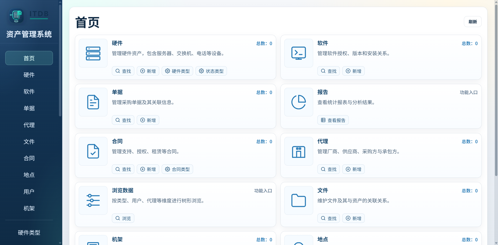

# ITDB — IT 资产管理系统

基于 [sivann/itdb](https://github.com/sivann/itdb)（PHP + SQLite）重构的 IT 资产管理系统，使用 Go + Vue3 前后端分离架构重新实现。支持硬件设备、软件许可、合同、单据、文件、机架、地点等资产的全生命周期管理。

登录页面左侧动画效果借鉴了 [Animated Characters Login Page](https://21st.dev/community/components/aghasisahakyan1/animated-characters-login-page) 。

## 目录

- [文档站点](#文档站点)
- [一、项目介绍](#一项目介绍)
- [二、本地开发快速启动](#二本地开发快速启动)
- [三、Docker Compose 快速部署（推荐）](#三docker-compose-快速部署推荐)
- [四、生产环境部署](#四生产环境部署)
- [五、API 文档](#五api-文档)
- [六、数据库说明](#六数据库说明)
- [七、常见问题](#七常见问题)
- [八、安全建议](#八安全建议)
- [九、许可证](#九许可证)
- [十、版本历史](#十版本历史)
- [十一、致谢](#十一致谢)
- [十二、联系方式](#十二联系方式)

# 文档站点

> **在线文档站点：https://itdb-docs.jerion.cn/**

# 一、项目介绍

## 1.1 项目简介

该基于 [sivann/itdb](https://github.com/sivann/itdb)（PHP + SQLite）重构的 IT 资产管理系统，使用 Go + Vue3 前后端分离架构重新实现。支持硬件设备、软件许可、合同、单据、文件、机架、地点等资产的全生命周期管理。

## 1.2 项目预览

|               项目登录页                |
| :-------------------------------------: |
|  |

|               项目首页                |
| :-----------------------------------: |
|  |

## 1.3 项目特性

- **前后端分离**：`Go + SQLite` 后端，`Vue3 + Vite + TypeScript` 前端
- **纯 Go 实现**：SQLite 驱动使用 `modernc.org/sqlite`，无 CGO 依赖，交叉编译友好
- **双认证模式**：支持本地密码和 LDAP 两种登录方式
- **权限控制**：完全访问 / 只读两级权限
- **操作审计**：所有写操作记录到历史日志
- **自动备份**：每日 0 点自动 VACUUM INTO 备份数据库，Schema 变更前也会自动备份
- **会话管理**：JWT 认证，前端空闲 1 小时自动登出
- **标签打印**：支持 QR 码生成、多种标签纸预设
- **机架可视化**：独立机架视图页面
- **数据库导入**：支持从旧系统 .db 文件直接导入替换
- **错误信息中文本地化**

## 1.4 技术栈

### 1.4.1 后端

- **语言**：Go 1.25+
- **HTTP**：go-chi/chi v5
- **数据库**：SQLite
- **数据库驱动**：modernc.org/sqlite（纯 Go 实现，无 CGO 依赖）
- **认证**：本地密码 + LDAP 双模式登录、JWT 会话认证
- **密码安全**：golang.org/x/crypto
- **数据导出**：xuri/excelize v2
- **检索辅助**：mozillazg/go-pinyin

### 1.4.2 前端

- **框架**：Vue 3
- **构建工具**：Vite 7
- **语言**：TypeScript
- **路由**：Vue Router
- **状态管理**：Pinia
- **HTTP 客户端**：Axios
- **日期处理**：dayjs
- **二维码生成**：qrcode
- **字体**：IBM Plex Mono、Noto Sans SC

## 1.5 项目结构

```text
itdb/
├─ backend/                         # Go 后端服务
│  ├─ cmd/
│  │  ├─ server/                    # HTTP 服务、路由处理、数据库初始化与业务逻辑
│  │  └─ common/                    # 本地化、基础类型和通用工具
│  ├─ data/                         # SQLite 数据库、上传文件和备份目录（运行时生成）
│  ├─ docs/                         # Swagger/OpenAPI 生成文件
│  ├─ scripts/                      # 数据库备份脚本
│  ├─ .env.example                  # 后端环境变量模板
│  ├─ go.mod / go.sum               # Go 模块依赖
│  └─ main.go                       # 后端启动入口
├─ docs/                            # 项目运行说明与数据库迁移文档
├─ frontend/                        # Vue 前端应用
│  ├─ public/                       # 静态资源
│  ├─ src/
│  │  ├─ api/                       # Axios API 客户端封装
│  │  ├─ assets/styles/             # 全局样式
│  │  ├─ components/                # 公共组件
│  │  ├─ composables/               # 组合式函数
│  │  ├─ layouts/                   # 页面布局组件
│  │  ├─ pages/                     # 业务页面组件
│  │  ├─ router/                    # Vue Router 路由定义
│  │  └─ stores/                    # Pinia 状态管理
│  ├─ index.html                    # 前端 HTML 入口
│  ├─ package.json / package-lock.json
│  └─ vite.config.ts                # Vite 构建配置
├─ AGENTS.md                        # 项目开发规范
├─ LICENSE
└─ README.md
```

## 1.6 功能清单

### 1.6.1 资源管理

| 模块 | 说明 |
|:----:|:----:|
| 硬件资产 (Items) | 服务器、网络设备、PC 等硬件的全生命周期管理，支持 SN、IP、机架位置、关联发票/合同/文件 |
| 软件许可 (Software) | 软件许可证管理，支持许可数量、类型、版本、关联发票 |
| 合同 (Contracts) | 合同管理，支持合同类型/子类型、续签记录、关联硬件/软件/发票/文件 |
| 发票 (Invoices) | 发票管理，支持供应商/采购方、关联硬件/软件/合同/文件 |
| 文件 (Files) | 附件上传与管理，支持多种文件类型，可关联到硬件/软件/合同/发票 |
| 厂商/代理商 (Agents) | 供应商和代理商信息管理 |

### 1.6.2 基础设施

| 模块 | 说明 |
|:----:|:----:|
| 位置 (Locations) | 机房/楼层管理，支持平面图上传和热区标注 |
| 机柜 (Racks) | 机柜管理，支持 U 位可视化、正反面视图 |
| 标签打印 (Labels) | QR 码标签生成，支持多种标签纸预设、批量打印 |

### 1.6.3 字典与分类

| 模块 | 说明 |
|:----:|:----:|
| 硬件类型 (Item Types) | 硬件资产分类字典 |
| 合同类型 (Contract Types) | 合同分类及子类型字典 |
| 部门 (Departments) | 部门字典 |
| 状态 (Status Types) | 资产状态字典，支持自定义颜色 |
| 文件类型 (File Types) | 文件分类字典 |
| 标签 (Tags) | 自由标签，可关联硬件和软件 |

### 1.6.4 系统功能

| 模块 | 说明 |
|:----:|:----:|
| 认证 | 本地密码 + LDAP 双模式登录，JWT 48 小时有效期 |
| 权限 | 管理员（完全访问）/ 普通用户（只读）两级权限 |
| 操作历史 | 所有写操作自动记录，支持导出 Excel |
| 浏览历史 | 最近查看记录 |
| 仪表盘 | 资产统计概览 |
| 报表 | 内置多种统计报表 |
| 数据库导入 | 支持从旧系统 .db 文件直接导入替换 |
| 自动备份 | 每日 0 点自动备份数据库，Schema 变更前也会自动备份 |
| 数据库/全量备份下载 | 支持在线下载数据库备份和全量备份（含上传文件） |
| 空闲登出 | 前端空闲 1 小时自动跳转登录页 |

# 二、本地开发快速启动

## 2.1 环境要求

- Go 1.24+（后端）
- Node.js 20+

> 后端使用纯 Go SQLite 驱动（`modernc.org/sqlite`），无需安装 GCC 或 CGO 环境。

## 2.2 克隆项目

```bash
git clone https://github.com/zyx3721/itdb.git
cd itdb
```

## 2.3 后端配置与启动

1. 进入后端目录下载相关依赖：

```bash
cd backend
go mod tidy
```

2. 配置环境变量：

```bash
# 步骤1：复制模板文件
cp .env.example .env

# 步骤2：编辑 .env，按实际环境修改监听地址、密钥等信息
# 后端监听地址
ITDB_SERVER_ADDR=127.0.0.1:8080

# 数据库与上传目录
ITDB_DB_PATH=./data/itdb.db
ITDB_UPLOAD_DIR=./data/files

# 鉴权与接口行为
ITDB_JWT_SECRET=itdb-change-me
ITDB_HISTORY_LIMIT=1000
ITDB_CORS_ORIGINS=*
```

环境变量说明：

|         变量         |      默认值      |              说明              |
| :------------------: | :--------------: | :----------------------------: |
|  `ITDB_SERVER_ADDR`  | `127.0.0.1:8080` |            监听地址            |
|    `ITDB_DB_PATH`    |  `data/itdb.db`  |       SQLite 数据库路径        |
|  `ITDB_UPLOAD_DIR`   |   `data/files`   |        上传文件存储目录        |
|  `ITDB_JWT_SECRET`   | `itdb-change-me` | JWT 签名密钥，生产环境务必设置 |
| `ITDB_HISTORY_LIMIT` |      `1000`      |        操作历史保留条数        |
| `ITDB_CORS_ORIGINS`  |       `*`        | 允许的跨域来源，多个用逗号分隔 |

3. 运行后端服务：

```bash
# 方式1：前台运行（终端关闭则服务停止）
go run main.go

# 方式2：后台运行（日志输出到 app.log）
nohup go run main.go > app.log 2>&1 &
```

后端服务默认运行在 `http://localhost:8080` ，如需指定端口，请修改环境变量文件内的 `ITDB_SERVER_ADDR` 参数。首次启动会自动创建数据库和默认管理员账户 `admin / admin123` 。

## 2.4 前端配置与启动

1. 进入前端目录下载相关依赖：

```bash
cd frontend
npm install
```

2. 配置 API 地址（可选）：

```bash
# 配置说明：
# - 后端端口 = 8080：无需创建 .env 文件（默认值为 http://127.0.0.1:8080）
# - 后端端口 ≠ 8080：需要创建 .env 文件（指定正确端口，例如后端端口改为 8090）
#   创建 .env 文件，例如：
echo "VITE_API_BASE=http://localhost:8090" > .env
```

3. 启动前端服务：

```bash
# 方式1：前台运行（终端关闭则服务停止）
npm run dev

# 方式2：后台运行（日志输出到 frontend.log）
nohup npm run dev > frontend.log 2>&1 &
```

前端服务默认运行在 `http://localhost:3000`  ，提供了非本机也能访问，将 `localhost` 改为实际 IP 地址即可。

## 2.5 访问系统

- **首页**：`http://localhost:3000`
  - **默认用户名**：`admin`
  - **默认密码**：`admin123`
- **API 文档**：`http://localhost:8080/swagger/index.html`

# 三、Docker Compose 快速部署（推荐）

## 3.1 部署目录结构

所有相关文件统一放在 `deploy/` 目录下，单镜像包含前端（Nginx）、后端（backend），通过 supervisord 管理多进程。

```bash
deploy/
├── docker-compose.yml    # 服务编排配置
├── entrypoint.sh         # 容器启动脚本
├── nginx.conf            # 反向代理配置
├── supervisord.conf      # 多进程管理配置
├── .env                  # 环境变量（需自行创建，见 3.2）
├── .env.example          # 环境变量模板
├── data/                 # 应用持久化数据（首次启动自动创建）
│   ├── itdb.db           # SQLite 数据库（首次启动自动创建）
│   ├── files/            # 上传的附件文件
│   ├── backups/          # 自动备份文件
│   └── logs/             # 运行日志

```

## 3.2 准备配置文件

进入 `deploy` 目录，创建 `.env` 环境变量文件：

```bash
cd deploy
vim .env
```

`.env` 文件内容参考：

```bash
# 鉴权与接口行为
ITDB_JWT_SECRET=itdb-change-me
ITDB_HISTORY_LIMIT=1000
ITDB_CORS_ORIGINS=*
```

## 3.3 构建镜像（可选）

如果不想使用阿里云镜像仓库的镜像，可直接在本地手动构建（默认使用阿里云镜像仓库地址）：

```bash
# 在 deploy/ 目录下构建（构建上下文为项目根目录）
cd deploy
docker build \
  -f Dockerfile \
  -t itdb:latest \
  --build-arg ALPINE_MIRROR=mirrors.aliyun.com \
  ..
```

然后修改 `deploy/docker-compose.yml` 中 `itdb` 服务的 `image` 字段为 `itdb:latest` 。

## 3.4 启动服务

```bash
cd deploy
docker compose up -d
```

## 3.5 服务管理

```bash
# 查看服务状态
docker compose ps

# 查看实时日志
docker compose logs -f itdb

# 重启 itdb 服务
docker compose restart itdb

# 停止所有服务
docker compose down

# 停止并删除数据卷（谨慎！数据会丢失）
docker compose down -v
```

## 3.6 访问系统

服务启动后，访问以下地址：

- **首页**：`http://your-domain.com`
  - **默认用户名**：`admin`
  - **默认密码**：`admin123`
- **API 文档**：`http://your-domain.com/swagger/index.html`
- **健康检查**：`https://your-domain.com/health`

## 3.7 宿主机 Nginx 反代（可选）

如需通过宿主机 Nginx 配置 HTTPS，将 `deploy/docker-compose.yml` 中的端口映射改为非 80 端口（如 `8080:80`），再配置外部 Nginx 代理：

### 3.7.1 HTTP 示例

```nginx
server {
    listen 80;
    server_name your-domain.com;

    # 限制上传文件大小（可选）
    client_max_body_size 500m;

    # Gzip 压缩配置
    gzip on;
    gzip_vary on;
    gzip_proxied any;
    gzip_comp_level 6;
    gzip_types text/plain text/css text/xml text/javascript
               application/json application/javascript application/xml+rss
               application/rss+xml font/truetype font/opentype
               application/vnd.ms-fontobject image/svg+xml;
    gzip_min_length 1000;

    # 日志配置
    access_log /usr/local/nginx/logs/itdb-access.log;
    error_log /usr/local/nginx/logs/itdb-error.log warn;

    location / {
        proxy_pass http://127.0.0.1:8080;
        proxy_http_version 1.1;
        proxy_set_header Upgrade $http_upgrade;
        proxy_set_header Connection "upgrade";
        proxy_set_header Host $host;
        proxy_set_header X-Real-IP $remote_addr;
        proxy_set_header X-Forwarded-For $proxy_add_x_forwarded_for;
        proxy_set_header X-Forwarded-Proto $scheme;

        # 超时配置
        proxy_connect_timeout 600s;
        proxy_send_timeout 600s;
        proxy_read_timeout 600s;
    }
}
```

### 3.7.2 HTTPS 示例

> HTTPS 示例（含 80→443 跳转，请替换证书路径）：

```nginx
# HTTP 80端口配置，自动重定向到HTTPS
server {
    listen 80;
    server_name your-domain.com;   # 修改为你的域名/主机名，例如：itdb.cn
    return 301 https://$host$request_uri;
}

# itdb 站点 HTTPS 配置
server {
    # listen 443 ssl http2;  # Nginx 1.25 以下版本写法
    listen 443 ssl;
    http2 on;
    server_name your-domain.com;   # 修改为你的域名/主机名，例如：itdb.cn

    # 证书路径（替换为实际证书文件）
    ssl_certificate     /usr/local/nginx/ssl/your-domain.com.pem;  # 例如：/usr/local/nginx/ssl/itdb.cn.pem
    ssl_certificate_key /usr/local/nginx/ssl/your-domain.com.key;  # 例如：/usr/local/nginx/ssl/itdb.cn.key

    # SSL安全优化
    ssl_protocols              TLSv1.2 TLSv1.3;
    ssl_prefer_server_ciphers  on;
    ssl_ciphers                ECDHE-RSA-AES128-GCM-SHA256:HIGH:!aNULL:!MD5:!RC4:!DHE;
    ssl_session_timeout        10m;
    ssl_session_cache          shared:SSL:10m;

    # 限制上传文件大小（可选）
    client_max_body_size 500m;

    # Gzip 压缩配置
    gzip on;
    gzip_vary on;
    gzip_proxied any;
    gzip_comp_level 6;
    gzip_types text/plain text/css text/xml text/javascript
               application/json application/javascript application/xml+rss
               application/rss+xml font/truetype font/opentype
               application/vnd.ms-fontobject image/svg+xml;
    gzip_min_length 1000;

    # 日志配置
    access_log /usr/local/nginx/logs/itdb-access.log;
    error_log /usr/local/nginx/logs/itdb-error.log warn;

    location / {
        proxy_pass http://127.0.0.1:8080;
        proxy_http_version 1.1;
        proxy_set_header Upgrade $http_upgrade;
        proxy_set_header Connection "upgrade";
        proxy_set_header Host $host;
        proxy_set_header X-Real-IP $remote_addr;
        proxy_set_header X-Forwarded-For $proxy_add_x_forwarded_for;
        proxy_set_header X-Forwarded-Proto $scheme;

        # 超时配置
        proxy_connect_timeout 600s;
        proxy_send_timeout 600s;
        proxy_read_timeout 600s;
    }
}
```

# 四、生产环境部署

## 4.1 克隆项目

```bash
git clone https://github.com/zyx3721/itdb.git
cd itdb
```

## 4.2 后端构建与配置

1. 进入后端目录下载相关依赖：

```bash
cd backend
go mod tidy
```

2. 配置环境变量：

```bash
# 步骤1：复制模板文件
cp .env.example .env

# 步骤2：编辑 .env，按实际环境修改监听地址、密钥等信息
# 后端监听地址
ITDB_SERVER_ADDR=127.0.0.1:8080

# 数据库与上传目录
ITDB_DB_PATH=./data/itdb.db
ITDB_UPLOAD_DIR=./data/files

# 鉴权与接口行为
ITDB_JWT_SECRET=itdb-change-me
ITDB_HISTORY_LIMIT=1000
ITDB_CORS_ORIGINS=*
```

3. 构建后端可执行文件：

```bash
go build -o itdb-backend main.go
```

4. 运行后端服务： 

```bash
# 方式1：前台运行（终端关闭则服务停止）
./itdb-backend

# 方式2：后台运行（日志输出到 app.log）
nohup ./itdb-backend > app.log 2>&1 &

# 方法3：加入 systemd 管理启动运行
# 服务配置参考如下，请自行修改相应目录路径
cat > /etc/systemd/system/itdb-backend.service <<EOF
[Unit]
Description=ITDB Backend Service
After=network.target network-online.target
Wants=network-online.target

[Service]
Type=simple
WorkingDirectory=/data/itdb/backend
ExecStart=/data/itdb/backend/itdb-backend
Restart=on-failure
RestartSec=5
LimitNOFILE=65535
StandardOutput=journal
StandardError=journal
SyslogIdentifier=itdb-backend

[Install]
WantedBy=multi-user.target
EOF

# 重载服务配置并启动
systemctl daemon-reload
systemctl start itdb-backend

# 设置开机自启
systemctl enable --now itdb-backend
```

后端服务默认运行在 `http://localhost:8080` ，如需指定端口，请修改环境变量文件内的 `ITDB_SERVER_ADDR` 参数。

## 4.3 前端构建与配置

1. 进入前端目录下载相关依赖：

```bash
cd frontend
npm install
```

2. 构建前端项目：

```bash
npm run build
```

构建产物在 `dist` 目录，可部署到任何静态服务器（Nginx、Vercel、Netlify 等）。生产环境前端无需配置 API 地址，统一通过 Nginx `/api/` 反向代理到后端。

## 4.4 配置Nginx反向代理

在服务器上准备前端目录（例如 `/data/itdb/frontend/dist`），**将本地 `dist` 目录中的所有文件和子目录整体上传到该目录**，保持结构不变，例如：

```bash
/data/itdb/frontend/dist/
├── assets/
├── images/
├── index.html
```

Nginx 中的 `root` 应指向 **包含 `index.html` 的目录本身**（如 `/data/itdb/frontend/dist` ，可按实际路径调整），而不是上级目录。

### 4.4.1 HTTP 示例

> 配置 Nginx （按需替换域名/路径/证书），`HTTP 示例` ：

```nginx
server {
    listen 80;
    server_name your-domain.com;   # 修改为你的域名/主机名，例如：itdb.cn
    
    # 前端静态资源目录（dist 构建产物）
    root /data/itdb/frontend/dist;  # 按实际部署路径修改
    index index.html;
    
    # 限制上传文件大小（可选）
    client_max_body_size 500m;
    
    # Gzip 压缩配置
    gzip on;
    gzip_vary on;
    gzip_proxied any;
    gzip_comp_level 6;
    gzip_types text/plain text/css text/xml text/javascript
               application/json application/javascript application/xml+rss
               application/rss+xml font/truetype font/opentype
               application/vnd.ms-fontobject image/svg+xml;
    gzip_min_length 1000;
    
    # 日志配置
    access_log /usr/local/nginx/logs/itdb-access.log;
    error_log /usr/local/nginx/logs/itdb-error.log warn;
    
    # 前端路由回退到 index.html（适配前端 history 模式）
    location / {
        try_files $uri $uri/ /index.html;
    }
    
    # 后端 API 反向代理
    location /api/ {
        proxy_pass http://127.0.0.1:8080;  # 与后端 API 相同地址
        proxy_http_version 1.1;
        proxy_set_header Upgrade $http_upgrade;
        proxy_set_header Connection "upgrade";
        proxy_set_header Host $host;
        proxy_set_header X-Real-IP $remote_addr;
        proxy_set_header X-Forwarded-For $proxy_add_x_forwarded_for;
        proxy_set_header X-Forwarded-Proto $scheme;
        proxy_connect_timeout 60s;
        proxy_send_timeout 300s;
        proxy_read_timeout 300s;
    }
    
    # 后端 API 文档
    location /swagger/ {
        proxy_pass http://127.0.0.1:8080;  # 与后端 API 相同地址
        proxy_set_header Host $host;
        proxy_set_header X-Real-IP $remote_addr;
        proxy_set_header X-Forwarded-For $proxy_add_x_forwarded_for;
        proxy_set_header X-Forwarded-Proto $scheme;
    }

    # 健康检查
    location = /health {
        proxy_pass http://127.0.0.1:8080/api/health;
    }
}
```

### 8.4.2 HTTPS 示例

> HTTPS 示例（含 80→443 跳转，请替换证书路径）：

```nginx
# HTTP 80端口配置，自动重定向到HTTPS
server {
    listen 80;
    server_name your-domain.com;   # 修改为你的域名/主机名，例如：itdb.cn
    return 301 https://$host$request_uri;
}

# itdb 站点 HTTPS 配置
server {
    # listen 443 ssl http2;  # Nginx 1.25 以下版本写法
    listen 443 ssl;
    http2 on;
    server_name your-domain.com;   # 修改为你的域名/主机名，例如：itdb.cn

    # 证书路径（替换为实际证书文件）
    ssl_certificate     /usr/local/nginx/ssl/your-domain.com.pem;  # 例如：/usr/local/nginx/ssl/itdb.cn.pem
    ssl_certificate_key /usr/local/nginx/ssl/your-domain.com.key;  # 例如：/usr/local/nginx/ssl/itdb.cn.key
    
    # SSL安全优化
    ssl_protocols              TLSv1.2 TLSv1.3;
    ssl_prefer_server_ciphers  on;
    ssl_ciphers                ECDHE-RSA-AES256-GCM-SHA512:DHE-RSA-AES256-GCM-SHA512:ECDHE-RSA-AES256-GCM-SHA384:DHE-RSA-AES256-GCM-SHA384;
    ssl_session_timeout        10m;
    ssl_session_cache          shared:SSL:10m;

    # 前端静态资源目录（dist 构建产物）
    root /data/itdb/frontend/dist;  # 按实际部署路径修改
    index index.html;
    
    # 限制上传文件大小（可选）
    client_max_body_size 500m;
    
    # Gzip 压缩配置
    gzip on;
    gzip_vary on;
    gzip_proxied any;
    gzip_comp_level 6;
    gzip_types text/plain text/css text/xml text/javascript
               application/json application/javascript application/xml+rss
               application/rss+xml font/truetype font/opentype
               application/vnd.ms-fontobject image/svg+xml;
    gzip_min_length 1000;

    # 日志配置
    access_log /usr/local/nginx/logs/itdb-access.log;
    error_log /usr/local/nginx/logs/itdb-error.log warn;
    
    # 前端路由回退到 index.html（适配前端 history 模式）
    location / {
        try_files $uri $uri/ /index.html;
    }
    
    # 后端 API 反向代理
    location /api/ {
        proxy_pass http://127.0.0.1:8080;  # 与后端 API 相同地址
        proxy_http_version 1.1;
        proxy_set_header Upgrade $http_upgrade;
        proxy_set_header Connection "upgrade";
        proxy_set_header Host $host;
        proxy_set_header X-Real-IP $remote_addr;
        proxy_set_header X-Forwarded-For $proxy_add_x_forwarded_for;
        proxy_set_header X-Forwarded-Proto $scheme;
        proxy_connect_timeout 60s;
        proxy_send_timeout 300s;
        proxy_read_timeout 300s;
    }
    
    # 后端 API 文档
    location /swagger/ {
        proxy_pass http://127.0.0.1:8080;  # 与后端 API 相同地址
        proxy_set_header Host $host;
        proxy_set_header X-Real-IP $remote_addr;
        proxy_set_header X-Forwarded-For $proxy_add_x_forwarded_for;
        proxy_set_header X-Forwarded-Proto $scheme;
    }

    # 健康检查
    location = /health {
        proxy_pass http://127.0.0.1:8080/api/health;
    }
}
```

重载 Nginx：

```bash
# 检查语法
nginx -t

# 重载配置
## 方法1
nginx -s reload
## 方法2
systemctl reload nginx
```

## 4.5 访问系统

- **首页**：`http://your-domain.com`
  - **默认用户名**：`admin`
  - **默认密码**：`admin123`

- **后端健康检查**：`http://your-domain.com/health` 

# 五、API 文档

后端已集成 Swagger/OpenAPI 文档，启动后可通过以下地址查看在线接口文档：

- **Swagger UI**：`http://localhost:8080/swagger/index.html`
- **OpenAPI JSON**：`http://localhost:8080/swagger/doc.json`
- **健康检查**：`GET /health`、`GET /api/health`

除 `POST /api/auth/login`、`GET /health` 和 `GET /api/health` 外，其他接口均需要在请求头中携带 `Authorization: Bearer <token>`。

写操作接口（POST / PUT / DELETE）需要管理员权限，只读用户仅可访问 GET 接口。

## 5.1 认证与启动数据

- `POST /api/auth/login` - 用户登录，支持本地密码和 LDAP 模式
- `GET /api/auth/me` - 获取当前登录用户信息
- `POST /api/auth/logout` - 登出当前会话
- `GET /api/bootstrap` - 获取前端启动所需字典、用户、位置、机架等基础数据
- `GET /api/dashboard/summary` - 获取仪表盘资源统计概览

登录请求示例：

```json
{
  "username": "admin",
  "password": "admin123",
  "mode": "local"
}
```

## 5.2 核心资产资源

- `GET /api/items?search=&limit=50&offset=0` - 获取硬件资产列表
- `GET /api/items/{id}` - 获取硬件资产详情，包含关联发票、软件、合同、文件、标签和操作记录
- `POST /api/items` - 创建硬件资产
- `PUT /api/items/{id}` - 更新硬件资产
- `DELETE /api/items/{id}` - 删除硬件资产
- `POST /api/items/{id}/tags` - 关联或移除硬件标签
- `GET /api/items/{id}/actions` - 获取硬件操作记录
- `POST /api/items/{id}/actions` - 创建硬件操作记录
- `PUT /api/items/{id}/actions/{actionId}` - 更新硬件操作记录
- `DELETE /api/items/{id}/actions/{actionId}` - 删除硬件操作记录

## 5.3 软件、发票与合同

- `GET /api/software?search=&limit=50&offset=0` - 获取软件许可列表
- `GET /api/software/{id}` - 获取软件许可详情
- `POST /api/software` - 创建软件许可
- `PUT /api/software/{id}` - 更新软件许可
- `DELETE /api/software/{id}` - 删除软件许可
- `POST /api/software/{id}/tags` - 关联或移除软件标签
- `GET /api/invoices?search=&limit=50&offset=0` - 获取发票列表
- `GET /api/invoices/{id}` - 获取发票详情
- `POST /api/invoices` - 创建发票
- `PUT /api/invoices/{id}` - 更新发票
- `DELETE /api/invoices/{id}` - 删除发票
- `GET /api/contracts?search=&limit=50&offset=0` - 获取合同列表
- `GET /api/contracts/{id}` - 获取合同详情
- `POST /api/contracts` - 创建合同
- `PUT /api/contracts/{id}` - 更新合同
- `DELETE /api/contracts/{id}` - 删除合同
- `GET /api/contracts/{id}/events` - 获取合同事件
- `POST /api/contracts/{id}/events` - 创建合同事件
- `PUT /api/contracts/{id}/events/{eventId}` - 更新合同事件
- `DELETE /api/contracts/{id}/events/{eventId}` - 删除合同事件

## 5.4 文件、位置与机柜

- `GET /api/files?search=` - 获取文件列表
- `GET /api/files/{id}` - 获取文件详情
- `GET /api/files/{id}/download` - 下载文件
- `POST /api/files` - 上传文件，使用 `multipart/form-data`
- `PUT /api/files/{id}` - 更新文件，可选择替换上传文件
- `DELETE /api/files/{id}` - 删除文件
- `GET /api/locations?search=` - 获取位置列表
- `GET /api/locations/{id}` - 获取位置详情，包含区域列表
- `GET /api/locations/{id}/floorplan` - 查看位置平面图
- `POST /api/locations` - 创建位置，可上传平面图
- `PUT /api/locations/{id}` - 更新位置，可替换平面图
- `DELETE /api/locations/{id}` - 删除位置
- `GET /api/locations/{id}/areas` - 获取位置区域
- `POST /api/locations/{id}/areas` - 创建位置区域
- `PUT /api/locations/{id}/areas/{areaId}` - 更新位置区域
- `DELETE /api/locations/{id}/areas/{areaId}` - 删除位置区域
- `GET /api/racks?search=` - 获取机柜列表
- `GET /api/racks/{id}` - 获取机柜详情
- `POST /api/racks` - 创建机柜
- `PUT /api/racks/{id}` - 更新机柜
- `DELETE /api/racks/{id}` - 删除机柜

## 5.5 厂商、用户、字典与标签

- `GET /api/agents?search=&limit=50&offset=0` - 获取厂商 / 代理商列表
- `GET /api/agents/{id}` - 获取厂商 / 代理商详情
- `POST /api/agents` - 创建厂商 / 代理商
- `PUT /api/agents/{id}` - 更新厂商 / 代理商
- `DELETE /api/agents/{id}` - 删除厂商 / 代理商
- `GET /api/users?search=&limit=25&offset=0` - 获取用户列表
- `GET /api/users/{id}` - 获取用户详情
- `POST /api/users` - 创建用户
- `PUT /api/users/{id}` - 更新用户
- `DELETE /api/users/{id}` - 删除用户
- `GET /api/dictionaries` - 获取所有字典数据
- `POST /api/dictionaries/{name}` - 创建字典行
- `PUT /api/dictionaries/{name}/{id}` - 更新字典行
- `DELETE /api/dictionaries/{name}/{id}` - 删除字典行
- `GET /api/tags?search=` - 获取标签列表
- `GET /api/tags/suggest?term=` - 获取标签建议
- `POST /api/tags` - 创建标签
- `PUT /api/tags/{id}` - 更新标签
- `DELETE /api/tags/{id}` - 删除标签
- `GET /api/tags/{id}/items` - 获取标签关联硬件
- `GET /api/tags/{id}/software` - 获取标签关联软件

## 5.6 报表、浏览树与标签打印

- `GET /api/reports` - 获取报表定义列表
- `GET /api/reports/{name}?limit=1000` - 执行指定报表
- `GET /api/browse/tree?id=` - 获取资源浏览树节点
- `GET /api/labels/items?search=&orderBy=&limit=1000&offset=0` - 获取可打印标签的资产列表
- `GET /api/labels/presets` - 获取标签纸预设
- `POST /api/labels/preview` - 生成标签打印预览数据
- `POST /api/labels/presets` - 创建标签纸预设
- `DELETE /api/labels/presets/{id}` - 删除标签纸预设

## 5.7 系统设置、历史与运维

- `GET /api/settings` - 获取系统设置
- `PUT /api/settings` - 更新系统设置
- `POST /api/settings/test-ldap` - 测试 LDAP 连接
- `GET /api/history?search=&limit=25&offset=0` - 获取操作历史
- `GET /api/history/export` - 导出操作历史 Excel
- `GET /api/view-history` - 获取最近浏览历史
- `POST /api/view-history` - 记录最近浏览历史
- `GET /api/backups/database` - 下载当前 SQLite 数据库备份
- `GET /api/backups/full` - 下载全量备份包
- `POST /api/import/database` - 上传 `.db` 文件替换当前数据库，并自动执行兼容迁移

# 六、数据库说明

使用 SQLite 单文件数据库，默认路径 `backend/data/itdb.db`，共 36 张表。

## 6.1 核心业务表

| 表名 | 说明 |
|:----:|:----:|
| `items` | 硬件资产（核心表，含 SN、IP、机架位置、CPU/RAM/HD 等字段） |
| `software` | 软件许可证 |
| `contracts` | 合同 |
| `invoices` | 发票 |
| `files` | 文件附件 |
| `agents` | 厂商/代理商 |
| `users` | 系统用户 |
| `locations` | 位置/机房 |
| `racks` | 机柜 |
| `tags` | 标签 |
| `actions` | 硬件操作记录 |
| `contractevents` | 合同事件 |

## 6.2 关联表

| 表名 | 说明 |
|:----:|:----:|
| `item2inv` | 硬件 ↔ 发票 |
| `item2soft` | 硬件 ↔ 软件（含安装日期） |
| `item2file` | 硬件 ↔ 文件 |
| `itemlink` | 硬件 ↔ 硬件互联 |
| `contract2item` | 合同 ↔ 硬件 |
| `contract2soft` | 合同 ↔ 软件 |
| `contract2inv` | 合同 ↔ 发票 |
| `contract2file` | 合同 ↔ 文件 |
| `invoice2file` | 发票 ↔ 文件 |
| `soft2inv` | 软件 ↔ 发票 |
| `software2file` | 软件 ↔ 文件 |
| `tag2item` | 标签 ↔ 硬件 |
| `tag2software` | 标签 ↔ 软件 |

## 6.3 字典表

| 表名 | 说明 |
|:----:|:----:|
| `itemtypes` | 硬件类型 |
| `contracttypes` | 合同类型 |
| `contractsubtypes` | 合同子类型 |
| `dpttypes` | 部门 |
| `statustypes` | 资产状态（含颜色） |
| `filetypes` | 文件类型 |

## 6.4 系统表

| 表名 | 说明 |
|:----:|:----:|
| `settings` | 系统设置（LDAP 配置等，单行表） |
| `history` | 操作审计日志 |
| `viewhist` | 浏览历史 |
| `labelpapers` | 标签纸预设 |
| `locareas` | 位置区域（平面图热区） |

# 七、常见问题

## 7.1 忘记管理员密码怎么办？

可通过 SQLite 命令行工具直接重置密码（推荐，不会丢失数据）：

```bash
# 停止后端服务后执行
sqlite3 backend/data/itdb.db "UPDATE users SET pass = 'admin123' WHERE username = 'admin';"
```

重启后端服务后，使用 `admin / admin123` 登录，系统会自动将明文密码升级为加密存储。

如果无法使用 sqlite3 工具，也可以删除数据库文件 `backend/data/itdb.db` 并重启服务，但这会清空所有数据，仅建议在全新部署时使用。

## 7.2 如何修改 JWT 有效期？

当前 JWT 有效期为 48 小时，硬编码在后端代码中。如需修改，编辑 `backend/cmd/server/handlers_auth_misc.go` 中第 73 行的 `48 * time.Hour`。

## 7.3 数据库文件可以直接复制迁移吗？

可以。SQLite 是单文件数据库，停止后端服务后直接复制 `itdb.db` 文件即可完成迁移。也可以通过系统内置的数据库导入功能在线替换。

## 7.4 如何从旧版 PHP ITDB 迁移？

旧版 PHP ITDB 同样使用 SQLite 数据库，可通过系统的「数据库导入」功能直接上传旧版 .db 文件进行替换。系统会自动执行 Schema 迁移。

## 7.5 如何启用 LDAP 登录？

LDAP 登录需要两步配置：

1. 在「系统设置」中配置 LDAP 服务器地址、Base DN、Bind DN 等连接参数，并启用 LDAP 认证
2. 在「用户管理」中创建与 LDAP 账号同名的用户（用户名必须与 LDAP 中的 `sAMAccountName` 一致）

登录时用户选择「LDAP」模式，系统会先在本地用户表中查找该用户名，再通过 LDAP 服务器验证密码。如果本地用户表中不存在对应用户，即使 LDAP 密码正确也无法登录。

## 7.6 自动备份存储在哪里？

自动备份存储在 `backend/data/backups/` 目录，命名格式为 `itdb-YYYYMMDD.db`，每天 0 点自动执行。

## 7.7 上传文件大小有限制吗？

后端默认无大小限制，但如果使用 Nginx 反向代理，需要配置 `client_max_body_size`（参考上方 Nginx 配置示例）。

# 八、安全建议

1. **修改默认密码**：首次部署后立即修改 `admin` 账户的默认密码
2. **设置 JWT 密钥**：生产环境务必在 `.env` 中设置 `ITDB_JWT_SECRET`，避免使用随机生成的临时密钥
3. **启用 HTTPS**：生产环境建议通过 Nginx 配置 SSL 证书，启用 HTTPS 访问
4. **限制访问来源**：通过 Nginx 或防火墙限制系统的访问 IP 范围
5. **定期备份**：虽然系统已有每日自动备份，建议额外配置异地备份策略
6. **文件目录权限**：确保 `backend/data/` 目录权限合理，避免非授权访问数据库和上传文件
7. **环境变量安全**：`.env` 文件包含敏感信息，确保不被提交到版本控制（已在 `.gitignore` 中排除）
8. **CORS 配置**：生产环境按需配置 `ITDB_CORS_ORIGINS`，避免设置为 `*`

# 九、许可证

本项目采用 [MIT License](LICENSE) 开源协议。

MIT License 是一个宽松的开源许可证，允许您自由地使用、复制、修改、合并、发布、分发、再许可和/或销售本软件的副本。唯一的要求是在所有副本或重要部分中保留版权声明和许可声明。

# 十、版本历史

| 版本 | 发布日期 | 版本说明 | 详细日志 |
|:----:|:--------:|:--------:|:--------:|
| v1.0.0 | 2026-06-27 | 首个正式版本，完成 Go + Vue3 前后端分离重构、核心资产管理、Docker Compose 部署和数据库迁移能力 | [verchanglog/v1.0.0.md](verchanglog/v1.0.0.md) |

# 十一、致谢

感谢以下开源项目和技术社区的支持：

- [sivann/itdb](https://github.com/sivann/itdb) - 原始 PHP 版本 ITDB 项目
- [Gin](https://github.com/gin-gonic/gin) - 高性能的 Go Web 框架
- [Vue.js](https://github.com/vuejs/core) - 渐进式 JavaScript 框架
- [GORM](https://github.com/go-gorm/gorm) - Go 语言 ORM 库
- [modernc.org/sqlite](https://gitlab.com/cznic/sqlite) - 纯 Go 实现的 SQLite 驱动
- [Ant Design Vue](https://github.com/vueComponent/ant-design-vue) - 企业级 UI 组件库
- [Pinia](https://github.com/vuejs/pinia) - Vue 3 状态管理库
- [Vite](https://github.com/vitejs/vite) - 下一代前端构建工具

特别感谢所有为本项目贡献代码、提出建议和报告问题的开发者。

# 十二、联系方式

如果您在使用过程中遇到问题，或有任何建议和反馈，欢迎通过以下方式联系：

- **Email**: 416685476@qq.com
- **GitHub Issues**: [https://github.com/zyx3721/itdb/issues](https://github.com/zyx3721/itdb/issues)
- **项目主页**: [https://github.com/zyx3721/itdb](https://github.com/zyx3721/itdb)

---

**⭐ 如果这个项目对您有帮助，欢迎 Star 支持！**
